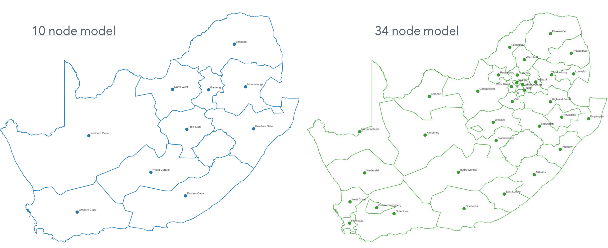

<!--
SPDX-FileCopyrightText:  PyPSA-RSA, PyPSA-Eur and PyPSA-Earth Authors

SPDX-License-Identifier: AGPL-3.0-or-later
-->

# Development Status: **Under development**

[](https://pypsa-rsa.readthedocs.io/en/latest/?badge=latest)
[](https://www.gnu.org/licenses/agpl-3.0)
[](https://discord.gg/bsdHkHwujt)
[](https://drive.google.com/drive/folders/17f54zTMEfeFZhNByXxLkf9qcZRdhng03)

# PyPSA-RSA: An open Optimisation Model of the South African Power System
The accelerating development of open-source energy system modelling tools in recent years has now reached the point where it opens up a credible alternative approach to closed source exclusivity. An ever increasing number of studies are demonstrating that it is possible to produce analysis of a high quality using open-source energy system models, whilst building a wider participating modelling community. This builds confidence in results by enabling more effective peer review of work and therefore more effective feedback loops. It also builds a consistent stream of new talent entering the space to ensure that energy sector analytical capacity can be retained and steadily expanded.

This model makes use of freely available and open data which encourages the open exchange of model data developments and eases the comparison of model results. It provides a full, automated software pipeline to assemble the optimisation model from the original datasets, which enables easy replacement and improvement of the individual parts. Running the model requires a wide range on input datasets. Users are required to access the following datasets from the original sources:

- [GIS shape files for supply regions](https://www.ntcsa.co.za/wp-content/uploads/2024/06/GCCA-2025-GIS.zip)
- [GIS data for existing Eskom transmission lines](https://www.ntcsa.co.za/wp-content/uploads/2024/06/Shapefiles-1.zip)
- [GIS data for population and GVA](http://stepsatest.csir.co.za/socio_econ.html)

Custom data generated for this model will need to be downloaded from [Google Drive](https://drive.google.com/drive/folders/17f54zTMEfeFZhNByXxLkf9qcZRdhng03)

# Spatial resolution
PyPSA-RSA has been designed to conduct capacity expansion planning and resource adequacy studies at differing spatial and temporal resolutions. Five different spatial resolutions are available in the model, and custom GIS shpae files can also be utilsied:

- ``1-supply``: A single node for the entire South Africa.
- ``10-supply``: 10 nodes based on the [GCCA 2025 Eskom Transmission Supply Regions](https://www.eskom.co.za/eskom-divisions/tx/gcca/).
- ``27-supply``: 27 nodes based on the Eskom 27 supply regions as per the original PyPSA-ZA model.
- ``34-supply``: 34 nodes based on the CLNs level in the [GCCA 2025 Eskom Local Supply Regions](https://www.eskom.co.za/eskom-divisions/tx/gcca/).
- ``159-supply``: 159 nodes based on the [GCCA 2025 Eskom Transmission MTS Regions](https://www.eskom.co.za/eskom-divisions/tx/gcca/).



PyPSA-RSA can be solved for a single year, or for multiple years, with perfect foresight. Multi-horizon capacity expansion planning is compuationally intensive, and therefore the spatial resolution will typically need to be reduced to ``1-supply`` or ``10-supply`` depending on the number of years modelled. By defualt PyPSA-RSA uses full chronology (8760h per year), but the number of snapshots can be reduced through the use of time-series 
segmentation through the open-source [Time Series Aggregation Module (TSAM)]( https://github.com/FZJ-IEK3-VSA/tsam/). 

# Resources to get started
PyPSA-RSA is built upon the fundamental components in the [PyPSA library](https://pypsa.org/). Before starting to use this model it is highly recommended to explore the [PyPSA documentation](https://pypsa.readthedocs.io/en/latest/index.html). More detailed documentation can be found under our [readthedocs](https://pypsa-za.readthedocs.io/en/latest/). A two-part video series on using PyPSA and PyPSA-RSA can be found under [link](https://meridianeconomics.co.za/our-publications/pypsa-rsa-workshop1/). Please feel free to join our [Discord channel](https://discord.gg/bsdHkHwujt) to ask questions. 

PyPSA-RSA assembles the mathematical equations that need to be solved to generate a result. Whilst open-source solvers such as [HiGHS](https://highs.dev/) and [CBC](https://github.com/coin-or/Cbc) can be used to solve smaller problems, a commercial solver is likely to be required for multi-horizon capacity expansion models. Suitable options include:
- [Gurobi](https://www.gurobi.com/) 
- [IBM CPLEX](https://www.ibm.com/products/ilog-cplex-optimization-studio/cplex-optimizer)
- [FICO Xpress](https://www.fico.com/en/products/fico-xpress-optimization)
- [COPT](https://www.shanshu.ai/copt)
- [MindOpt](https://opt.alibabacloud.com/)

RAM requirements will vary based on the complexity of the model. Multi-horizon capacity expansion planning models with full time chronology will likely require between 65-128GB of RAM. 

# Installation
1. Open your terminal at a location where you want to install pypsa-rsa. Type the following in your terminal to download the package from GitHub:
    ```bash
        .../some/path/without/spaces % git clone https://github.com/MeridianEconomics/pypsa-rsa.git
    ```
2. The python package requirements are curated in the `envs/environment.yaml` file.
   The environment can be installed using:

    ```bash
        .../pypsa-rsa % conda env create -f envs/environment.yaml
    ```

   If the above takes longer than 30min, you might want to try mamba for faster installation:

    ```bash
        (base) conda install -c conda-forge mamba

        .../pypsa-rsa % mamba env create -f envs/environment.yaml
    ```

3. For running the optimization one has to install the solver. We can recommend the open source HiGHs solver which installation manual is given [here](https://github.com/PyPSA/PyPSA/blob/633669d3f940ea256fb0a2313c7a499cbe0122a5/pypsa/linopt.py#L608-L632).

# Documentation
The documentation is available here: [documentation](https://pypsa-rsa.readthedocs.io/en/latest/?badge=latest).

# Developers
New collaborators are welcome! This project is currently maintained by [Meridian Economics]( https://meridianeconomics.co.za/). Previous versions were developed within the Energy Centre at the [Council for Scientific and Industrial Research (CSIR)](https://www.csir.co.za/) as part of the [CoNDyNet project](https://fias.institute/en/projects/condynet/), which is supported by the [German Federal Ministry of Education and Research](https://www.bmbf.de/bmbf/en/home/home_node.html) under grant no. 03SF0472C. Credits to Jonas Hörsch and Joanne Calitz who developed the original [PyPSA-ZA model](https://arxiv.org/pdf/1710.11199.pdf), [Meridian Economics](http://meridianeconomics.co.za) who extended the PyPSA-ZA model.PyPSA-RSA is relies on a number of functions from the [PyPSA-Eur](https://github.com/PyPSA/pypsa-eur) and [PyPSA-Meets-Earth](https://github.com/pypsa-meets-earth/pypsa-earth). 

