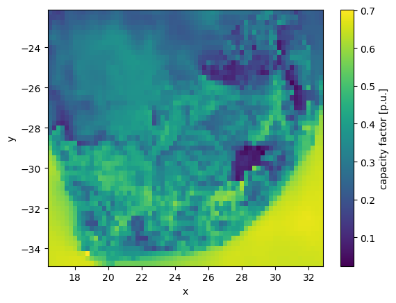

..
  SPDX-FileCopyrightText: 2021 The PyPSA meets Earth authors

  SPDX-License-Identifier: CC-BY-4.0

.. _data_workflow:

##########################################
Data used by the model
##########################################

This section explains in detail how PyPSA-RSA downloads and retrieves the various data types.

Preparing the power grid layout and climatic inputs are two essential aspects of the energy modelling workflow. In addition, PyPSA-RSA utilises several environmental, economic, and technological datasets.

1. Grid topology data
===================================

PyPSA-RSA allows the user to select the desired spatial resolution; shape files are presently available for South Africa, the nine provinces of South Africa, the ten supply areas outlined in the Eskom TDP, and the twenty-seven Eskom supply regions.
These shape files may be found in **GoogleDrive**, where `regions` represents the desired spatial resolution, such as `10-supply`.

The grid topology model is constructed using the `build_topology` rule. When the rule `build_topology` is executed, the buses and lines are computed and saved as geojson files in the folders `resources/buses-{scenario}.geojson` and `resources/lines-{scenario}.geojson` for each region.

2. Climate data
===================================

The climate data processing is provided by the `atlite <https://atlite.readthedocs.io/en/latest/>`_ package and `GWA <https://globalwindatlas.info/en/area/South%20Africa>`_.
The weather data from `ERA5 <https://www.ecmwf.int/en/forecasts/datasets/reanalysis-datasets/era5>`_ reanalysis weather 
dataset or `SARAH-2 <https://wui.cmsaf.eu/safira/action/viewProduktSearch>`_. The atlite modules and the weather data are used to build cutouts
and generate the time series of renewable potential build in `prepare_extendable_wind.ipynb` **CHECK**.
This also accounts for the wind speed at 100m using `GWA <https://globalwindatlas.info/en/area/South%20Africa>`_ 
data which is provided in **GoogleDrive**.

3. General data
===================================

There are a number datasets applied in PyPSA-RSA to build a realistic model. Original datasets are stored in the **GoogleDrive** folder. Currently we are using the following resources:

Environmental
------------------------------------

* **SAPAD** The South African Protected Areas Database (SAPAD)  

.. image:: img/copernicus.png
    :height: 150 px
    :align: center

It is used in the `preparing_availability_matrix.ipynb` to quantify what are the land regions available for the installation of renewable resources, e.g. renewable assets may not be installed on arable land. 

* **SACAD** The South African Conservation Areas Database (SACAD)  

.. image:: img/copernicus.png
    :height: 150 px
    :align: center

It is used in the `preparing_availability_matrix.ipynb` rule to quantify what are the land regions available for the installation of renewable resources, e.g. renewable assets may not be installed on arable land.

* **REDZ:** A dataset of the Renewable Energy Development Zones (REDZs) containing 8 priority areas for investment of wind and solar PV development available from the **Google drive link**

The dataset is used to restrict renewable energy expansion to the REDZs regions in `preparing_availability_matrix.ipynb`.

* **corridors:** A dataset of REDZs Strategic Transmission Corridors containing 5 priority areas for the investement of new electricity transmission and distribution infrustructure available from the **Google drive link**. 

The dataset is used to restrict renewable energy expansion to the strategic transmission corridors regions in the rule `preparing_availability_matrix.ipynb`.

.. image:: img/gebco_2021_grid_image.jpg
    :width: 150%
    :align: center

* **SAlandcover** A dataset of the South African National Land Cover **Google drive link**
Economical
------------------------------------

* **model_file_costs.csv** which contains the default costs of the technologies along with their typical lifetime and efficiency values. The dataset is intended to give a starting point for running the model while user specific adjustments may be made. 

* **ZAF15adjv4.tif** raster dataset of the population located in **Google drive link**

4. Pre-calculated datasets
===================================

There are some datasets which were prepared to ensure smooth run of the model. However, they may (and in some cases) must be replaced by custom ones. 

Currently the pre-build file is calculated for South Africa using the `SAPAD` and `SACAD` datasets. 

* **SystemEnergy2009_22.csv** is the electricity demand profile provided from the Eskom data portal. This pre-downloaded data on electricity demand is placed in **Google drive**.

* **eskom_pu_profiles.csv** is Eskom hourly pu profiles for all wind and solar generators in South Africa. This data is located in `data/eskom_pu_profiles.csv`

