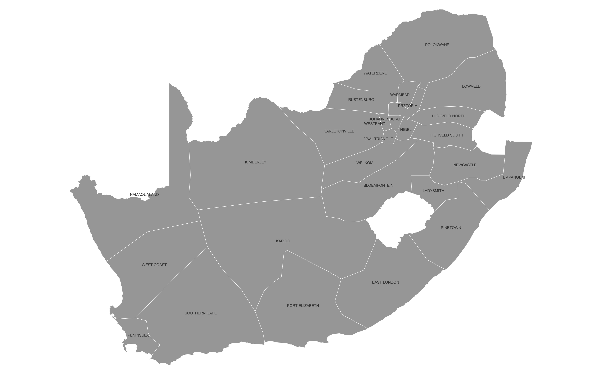

.. pypsa-za documentation master file, created by
   sphinx-quickstart on Fri Jan  6 10:47:23 2023.
   You can adapt this file completely to your liking, but it should at least
   contain the root `toctree` directive.

PyPSA-ZA: An open Optimisation Model of the South African Power System
=======================================================================

The accelerating development of open-source energy system modelling tools in recent years has now reached the point where it 
opens up a credible alternative approach to closed source exclusivity. An ever increasing number of studies are demonstrating that 
it is possible to produce analysis of a high quality using open-source energy system models, 
whilst building a wider participating modelling community.  This builds confidence in results by enabling more effective peer 
review of work and therefore more effective feedback loops. It also builds a consistent stream of new talent entering the 
space to ensure that energy sector analytical capacity can be retained and steadily expanded. 

PyPSA-ZA is an open energy model of the South African power system that can be 
utilised for both operational studies and generation and transmission expansion planning studies.
PyPSA-ZA is built upon the the open toolbox `PyPSA <https://pypsa.org/>`_ for which `documentation <https://pypsa.readthedocs.io/en/latest/index.html>`_ is available. 

This model makes use of freely available and open data which encourages the open exchange of model data developments and eases the comparison of model results. 
It provides a full, automated software pipeline to assemble the load-flow-ready model from the original datasets, which enables easy replacement and 
improvement of the individual parts. 

PyPSA-ZA has been designed to conduct capacity expansion planning studies at differing spatial and temporal resolutions. 
Three different spatial resolutions are available in the model:

- ``1-supply``: A single node for the entire South Africa.
- ``11-supply``: 11 nodes based on the `Eskom Generation Connection Capacity Assessment of the 2024 Transmission Network (GCCA – 2024)  <https://www.eskom.co.za/eskom-divisions/tx/gcca/>`_ regions.
- ``27-supply``: 27 nodes based on Eskom 27 supply regions as per the original PyPSA-ZA model.

.. image:: img/1-supply.png
   :width: 500
   :align: center
   :alt: 1-supply

PyPSA-ZA can be solved for a single year, or for multiple years, with perfect foresight.
Multi-horizon capacity expansion planning is compuationally intensive, and therefore 
the spatial resolution will typically need to be reduced to ``1-supply`` or ``11-supply``
depending on the number of years modelled. By defualt PyPSA-ZA uses full chronology
(8760h per year), but the number of snapshots can be reduced through the use of time-series 
segmentation through the open-source `Time Series Aggregation Module <https://github.com/FZJ-IEK3-VSA/tsam/>`_. 

This project is currently maintained by `Meridian Economics <https://meridianeconomics.co.za/>`_. Previous versions were developed within the Energy Centre 
at the `Council for Scientific and Industrial Research (CSIR) <https://www.csir.co.za/>`_ as part of the `CoNDyNet project <https://fias.institute/en/projects/condynet/>`_, which is supported by the 
`German Federal Ministry of Education and Research <https://www.bmbf.de/bmbf/en/home/home_node.html>`_ under grant no. 03SF0472C. 

The model is currently under development and has been validated for the single node (`1-supply`), for more information on the capability of the moel please see the :ref:`release-notes`. 

.. note::
   
  Credits to Jonas Hörsch and Joanne Calitz who developed the original PyPSA-ZA model (`<https://arxiv.org/pdf/1710.11199.pdf>`_ ), 
  Meridian Economics (`http://meridianeconomics.co.za`) who extended the PyPSA-ZA model.
  PyPSA-ZA is relies on a number of functions from the `PyPSA-Eur <https://github.com/PyPSA/pypsa-eur>`_ and `PyPSA-Meets-Earth <https://github.com/pypsa-meets-earth/pypsa-earth>`_.

=============
Documentation
=============

**Getting Started**

* :doc:`introduction`
* :doc:`installation`
* :doc:`workflow`
* :doc:`tutorials`
* :doc:`data_workflow`

.. toctree::
   :hidden:
   :maxdepth: 2
   :caption: Getting Started

   introduction
   installation
   workflow  
   tutorials
   data_workflow    

**Configuration**

* :doc:`wildcards`
* :doc:`configuration`
* :doc:`costs`

.. toctree::
   :hidden:
   :maxdepth: 2
   :caption: Configuration

   wildcards
   configuration
   costs

**API**

* :doc:`api_reference`

.. toctree::
   :hidden:
   :maxdepth: 2
   :caption: API

   api_reference

**Help and References**

* :doc:`release_notes`
* :doc:`how_to_contribute`

.. toctree::
   :hidden:
   :maxdepth: 2
   :caption: Project Info

   release_notes
   how_to_contribute
