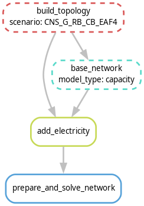

..
  SPDX-FileCopyrightText: 2021 The PyPSA-ZA authors

  SPDX-License-Identifier: CC-BY-4.0

.. _workflow:

##########################################
Workflow
##########################################

Overview
===========
Overview of PyPSA-RSA model architecture

.. image:: img/pypsa_rsa_model_architecture.png
    :width: 80%
    :align: center

The PyPSA-RSA model consists of four main blocks, the pre-processing, scenario configuration, snakemake workflow 
and post-processing.

Pre-processing
=======================================

This stage converts spatial and meteorological data into model-ready inputs. 
The input data includes GIS data, this is included with the model and may be found in the 
'data/bundle/' folder. The `pypsa-rsa/pre-processing` folder includes the jupyter notebook scripts to evaluate the 
weather and outage profiles. Pre-processed weather file is provided in the data download under the installation page.

Scenario Configuration
=======================================

In order to make the PyPSA-RSA model accessible to a larger audience than just 
developers and users who do not know Python, the input data into PyPSA-RSA is entered via Excel spreadsheets to 
aid with scenario configuration. The spreadsheets are located in the folder `pypsa-rsa/scenarios/ME IRP 2024`, 
this folder can be copied to house a users project. In the project folder the global scenario are 
specified in the excel spreadsheet `scenarios_to_run.xlsx`. Each row of `scenarios_to_run.xlsx` is a scenario 
to run.

`wildcard`
`run_scenario` True or False
`simulation_years` Years to simulate in the model separated by a comma (2025,2030)
`regions` spatial resolution, options are 1 for single node, 10 node, 34 Eskom supply regions
`resource_area` areas to build new RE capacity, options are redz, corridors or eia
`line_expansion` 
`options` 
`fixed_conventionl` Eskom, private IPP and RMIPPPP existing generators, characteristics for each scenario are specified in `sub_scenarios/fixed_technologies.xlsx` in the sheet conventional
`fixed_renewables` REIPPPP existing generators up to BW6 including existing distributed solar PV by province, characteristics for each scenario are specified in `sub_scenarios/fixed_technologies.xlsx` in the sheet renewables
`fixed_storage` BESIPPP existing and conracted capacity up to BW2, characteristics for each scenario are specified in `sub_scenarios/fixed_technologies.xlsx` in the sheet storage
`extendable_techs`
`extendable_max_total` scenario for maximum total installed capacity for renewable technologies and conventional ccgt, ocgt and diesel. Specified in sheet `max_total_installed` of `sub_scenarios/extendable_technologies.xlsx`
`extendable_min_total` scenario for minimum total installed capacity for renewable technologies and conventional ccgt, ocgt and diesel. Specified in sheet `min_total_installed` of `sub_scenarios/extendable_technologies.xlsx`
`extendable_max_annual` scenario for maximum annual build constraints for renewable technologies and conventional ccgt, ocgt and diesel. Specified in sheet `max_annual_installed` of `sub_scenarios/extendable_technologies.xlsx`
`extendable_min_annual` scenario for minimum annual build constraints for renewable technologies and conventional ccgt, ocgt and diesel. Specified in sheet `min_annual_installed` of `sub_scenarios/extendable_technologies.xlsx`
`operational_limits`  includes the cpacity factor, output energy, output power and primary energy for all technologies. Specified in  `operational_constraints` sheet of `sub_scenarios/operational_constraints.xlsx`
`outage_profiles` planned and unplanned outages per generator for existing and new conventional generators. specified in `outage_profiles` sheet of `sub_scenarios/plant_availability.xlsx`
`annual_availability` EAF per generator for all conventional generators. specified in sheet `annual_availability` sheet of `sub_scenarios/plant_availability.xlsx`
`extendable_parameters` 
`co2_constraints` Carbon constraints specified in `sub_scenarios/carbon_constraints.xlsx`
`min_station_hourly` Hourly capacity factor for coal specified as a %, 0% corresponding to coal being off in a particular year. Specified in `min_station_hrly_cap_fact` sheet of `sub_scenarios/plant_availability.xlsx`
`load_trajectory` annual load specified in TWh/yr. specified in `sub_scenarios/annual_load.xlsx`
`reserve_margin` specified in `sub_scenarios/reserve_margin.xlsx` sheet `reserve_margin`
`capacity_credits` specified in `sub_scenarios/reserve_margin.xlsx` sheet `capacity_credits`

The global scenario is defined as a 
combination of different `sub_scenarios` for each category of parameters. The following can be specified in 
`sub_scenarios`

Snakemake Workflow
=======================================

The entire execution of the workflow relies on the automated workflow management tool 
`Snakemake <https://snakemake.bitbucket.io/>`_ that iterates the execution of so-called "rules" in an 
organized way following the input-output chain. 

The ``Snakefile`` declares for each python script in the ``scripts`` directory a rule which describes which 
files the scripts consume and produce (their corresponding input and output files). The ``snakemake`` tool 
then runs the scripts in the correct order according to the rules' `input/output` dependencies. Moreover, it 
is able to track, what parts of the workflow have to be regenerated, when a data file or a script is 
modified/updated. For example, by executing the following snakemake routine:

.. code:: bash

    .../pypsa-rsa % snakemake -j1 results/'ME IRP 2024'/network/capacity-CNS_G_RB_CB_EAF4.nc

the following workflow is automatically executed.

The **blocks** represent the individual rules which are required to create the file 
``results/'ME IRP 2024'/network/capacity-CNS_G_RB_CB_EAF4.nc``. Each rule requires scripts (e.g. Python) 
to convert inputs to outputs. The **arrows** indicate the outputs from preceding rules which a particular 
rule takes as input data.

.. note::
    For reproducibility purposes, the image can be obtained through
    ``snakemake -q --dag results/'ME IRP 2024'/network/capacity-CNS_G_RB_CB_EAF4.nc   | sed -n '/^digraph /,$p'   | dot -Tpng -o workflow.png``
    using `Graphviz <https://graphviz.org/>`_

Post-Processing
=======================================

execute the optimization for the desired problem, e.g. dispatch, planning, etc.
